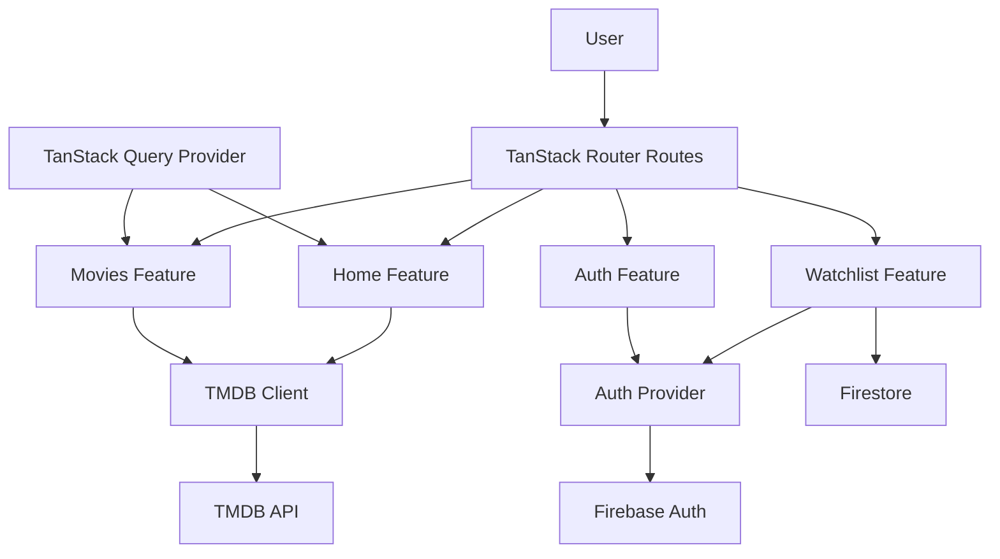

# CineWatch

CineWatch is a movie discovery and watchlist application built for a frontend interview submission. It helps users discover trending films, search the TMDB catalog, view rich movie details, and save titles to a personal watchlist.

Live URL (production): [https://cinewatch.saddathasan.dev](https://cinewatch.saddathasan.dev)

Demo video (Google Drive): [<add-link>](add-link)

## Intro

This app focuses on a clean, responsive user experience with a feature-first codebase. Core user journeys include:

- Browse weekly trending movies from TMDB
- Search movies with query + pagination
- View movie detail pages with metadata, cast, and trailer access
- Sign up / sign in / reset password with Firebase Auth
- After requesting password reset, users should check inbox and spam folder for reset email
- Persist a per-user watchlist with Firestore

The implementation prioritizes component architecture discipline, accessibility-minded UI patterns, and production-oriented deployment on Cloudflare Workers.

## Tech Stack

### Frontend

- React 19
- TypeScript (strict mode)
- Vite 7

### Routing, Data, Forms

- TanStack Router (file-based routing)
- TanStack Query (server state + caching)
- TanStack Form (auth form state/validation flow)

### UI and Motion

- Tailwind CSS v4
- shadcn/ui primitives
- Framer Motion
- Sonner (toast notifications)
- Lucide icons

### Backend Services

- TMDB API (movie data)
- Firebase Auth (email/password auth + reset)
- Firestore (watchlist persistence)

### Deployment

- Cloudflare Workers
- Wrangler

## Key Dependencies

### Runtime Dependencies

- `@tanstack/react-start` - app runtime and server entry for Workers
- `@tanstack/react-router` - route definitions and navigation
- `@tanstack/react-query` - cached async data fetching
- `@tanstack/react-form` - controlled form state and submit lifecycle
- `firebase` - authentication and Firestore integration
- `zod` + `@t3-oss/env-core` - runtime environment validation
- `tailwindcss` + `@tailwindcss/vite` - styling system and Vite integration
- `framer-motion` - animation and transition polish

### Development Dependencies

- `typescript` - static typing and strict checks
- `eslint` + `@tanstack/eslint-config` - linting rules and architecture consistency
- `prettier` - formatting
- `vitest` + testing-library packages - test tooling (currently minimal coverage)
- `wrangler` - local/dev/deploy workflow for Cloudflare Workers

## Architecture

The codebase follows a feature-first structure:

- Route files are composition-focused and lightweight
- Feature modules own business logic and UI orchestration
- Shared UI components live in `src/components`
- External service setup is isolated under `src/integrations`

### Project Structure

```txt
src/
├── components/                # Shared UI used across features
├── features/
│   ├── auth/                  # Auth sheet, login/signup/reset flows
│   ├── home/                  # Hero + trending strip
│   ├── layout/                # Navbar + navigation variants
│   ├── movies/                # Search + movie detail flows
│   └── watchlist/             # Watchlist page and actions
├── integrations/
│   ├── auth/                  # Auth provider + hook
│   ├── firebase/              # Firebase app/auth/firestore config
│   └── tanstack-query/        # Query provider/devtools
├── lib/                       # TMDB client, utility helpers
├── routes/                    # TanStack file-based route entries
├── env.ts                     # Runtime env validation
├── router.tsx                 # Router setup
└── routeTree.gen.ts           # Generated route tree (do not edit)
```

### Frontend Flow Diagram



## How to Run This App

### Prerequisites

- Node.js 22+
- pnpm 10+

### Environment Variables (`.env`)

Create a `.env` file in the project root with:

```bash
VITE_TMDB_API_KEY=
VITE_FIREBASE_API_KEY=
VITE_FIREBASE_AUTH_DOMAIN=
VITE_FIREBASE_PROJECT_ID=
VITE_FIREBASE_STORAGE_BUCKET=
VITE_FIREBASE_MESSAGING_SENDER_ID=
VITE_FIREBASE_APP_ID=
```

### Local Commands

```bash
pnpm install --frozen-lockfile
pnpm run dev
```

Quality/build commands:

```bash
pnpm run check
pnpm run build
pnpm run preview
```

## Cloudflare Workers Deployment

This project deploys on Cloudflare Workers using Git-connected builds on `main`.

### Build Configuration

- Build command: `pnpm run build`
- Deploy command: `npx wrangler deploy`
- Production domain: `https://cinewatch.saddathasan.dev`

### Required Cloudflare Variables

Set the same `VITE_*` keys in:

- Build variables (required for `pnpm run build`)
- Runtime variables/secrets (recommended for consistency)

Also ensure Firebase Auth authorized domains include:

- `cinewatch.saddathasan.dev`

## Submission Checklist

- Public GitHub repository containing the source code
- `README.md` with run instructions and basic documentation
- Demo video link:
  - Google Drive: `<add-link>`

## Known Limitations

- TMDB API rate limits can affect frequent/high-volume requests
- Current build emits large chunk-size warnings; further code splitting can improve this
- Automated test coverage is currently minimal (`pnpm run test` has no comprehensive suite yet)
- Firebase authentication behavior depends on correct domain allowlist setup
- Password reset emails may occasionally land in spam folders depending on email provider filtering

## Security Note

- No credentials should be committed to the repository
- All API keys and service configuration are expected through environment variables
